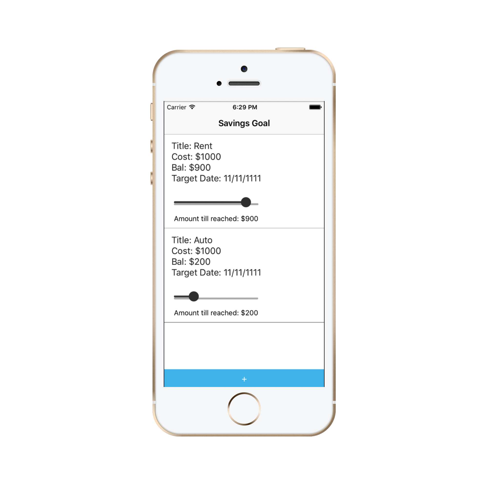
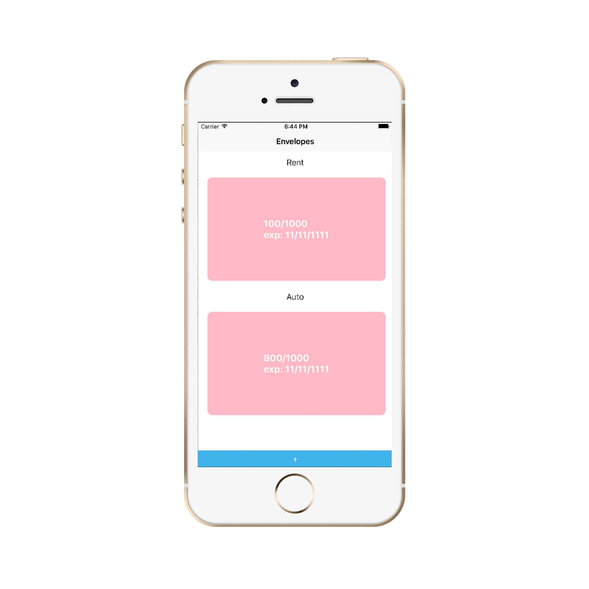

# React-Native-Finance-App
## Description

A finance app that I created to help me learn react-native. 

Disclaimer: not intended for production use.

## Screenshots

### Homepage/Login

### Spaced Repetition Page

## Tech Stack

- DB: cloud-hosted MongoDB with MLab

- Server: Node, Express, Mongoose

- Client: React, Redux, Thunk

- Security: Passport, OAuth, Bearer

# Database Structure - Sample Items

## Collections
#### `users`
	{
		accessToken: 'gfehu7438rr83yr374ry4387r38',
		googleId: 176374526734,
		name: 'Test User',
		score: 12,
		questions: [{word_id: 6327452, freq: 3}, {word_id: 673462, freq: 1}]
	}

#### `words`
	{
		_id: 6327452,
		french: 'un',
		english: 'one'
	}

---

## Endpoints:

- [x] app.get('/game')
  - returns an initial question for a logged-in user
  - protected endpoint

- [x] app.put('/game')
  - updates user's list of questions based on true/false input from client
  - returns a new question for the user
  - protected endpoint

- [x] app.get('/auth/google')
  - initializes Google login process

- [x] app.get('auth/login/callback')
  - continues Google login process

CREATE TABLE IF NOT EXISTS UserData (
	id serial primary key,
	essen text not null,
	flex text not null,
	lts text not null,
	expDate text not null,
	currentDate text not null
)

CREATE TABLE IF NOT EXISTS Envelopes (
	id serial primary key,
	title text not null,
	totalAmount text not null,
	currentAmount text not null,
	resetDate text not null
)

CREATE TABLE IF NOT EXISTS SavingsGoal (
	id serial primary key,
	title text not null,
	totalAmount text not null,
	currentAmount text not null,
	dateDesired text not null,
    status text not null
)
